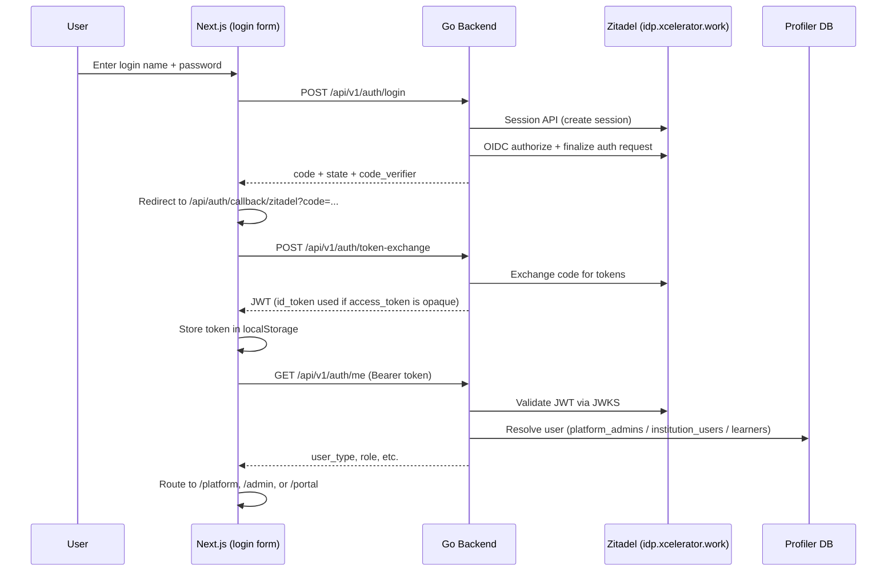

# Profiler Auth Setup — Zitadel + Go + Next.js

Reference for the authentication and authorization integration: what we built, problems we hit, fixes applied, and what each environment variable does.

---

## Architecture at a Glance



### Three layers of responsibility

| Layer | Role |
|-------|------|
| **Zitadel** | Identity — who you are (login, JWT issuance) |
| **Profiler DB** | Provisioning — is this person allowed in Profiler? (`platform_admins`, `institution_users`, `learners`) |
| **Casbin** | Authorization — what can they do? (RBAC per institution) |

---

## Problems We Hit and How We Fixed Them

### 1. Started with Auth.js → redirect to Zitadel hosted UI / Google

**Problem:** Next.js used Auth.js (next-auth), which redirected to Zitadel's hosted login page. The goal was the same pattern as other Xcelerator apps: **in-app login form**, not a redirect to `idp.xcelerator.work/ui/login`.

**Fix:** Removed Auth.js. Built a custom flow:

- Login form → backend `POST /api/v1/auth/login` → redirect to `/api/auth/callback/zitadel` → token exchange → dashboard.

---

### 2. `password login not configured` (503)

**Problem:** Backend had no `ZITADEL_SERVICE_USER_TOKEN`. Password login uses Zitadel's **Session API**, which requires a service user PAT with the `IAM_LOGIN_CLIENT` role.

**Fix:** Created a service user in Zitadel, granted `IAM_LOGIN_CLIENT`, generated a PAT, set `ZITADEL_SERVICE_USER_TOKEN` and `ZITADEL_LOGIN_CLIENT_ID` in backend `.env`.

---

### 3. Login name vs email — "User could not be found"

**Problem:** Login form initially sent **email** (`neerajgowda2611@gmail.com`) to Zitadel Session API as `loginName`. Zitadel returned **404 User could not be found**, even though the user existed in the profiler org.

**Root cause:** Zitadel Session API expects the **preferred login name** (`Neerajgowda`), not the email. Email and login name are separate fields in Zitadel.

**Fix:** Changed the form to **"Login name"** and send that value as-is to the Session API. After login, the JWT still contains `email`, which Profiler uses for DB lookup/JIT linking.

---

### 4. `authorize failed (400)` — redirect URI mismatch

**Problem:** Backend sent `redirect_uri=http://localhost:3000/auth/callback`, but Zitadel Web app only had registered:

```
http://localhost:3000/api/auth/callback/zitadel
```

(from the earlier Auth.js setup).

**Fix:** Aligned backend `ZITADEL_REDIRECT_URI` and frontend callback route to the URI already registered in Zitadel.

---

### 5. Login succeeded but bounced back to `/login` — "invalid JWT"

**Problem:** Flow worked through callback and token exchange (200), but `GET /api/v1/auth/me` returned 401 with `invalid JWT`.

**Root cause:** Zitadel's web app often returns an **opaque** `access_token` (random string, not a JWT). The Go backend tried to validate it as a JWT and failed.

**Fix:**

- If `access_token` is not a JWT, use **`id_token`** instead (always a JWT in OIDC).
- JWT validator accepts **both** `ZITADEL_API_AUDIENCE` and `ZITADEL_WEB_CLIENT_ID` as valid `aud` values.
- Added API audience scope to the OAuth authorize request for future JWT access tokens.

---

### 6. `user_not_provisioned` on login page

**Problem:** Dashboard redirected to `/login?error=user_not_provisioned` even when login hadn't succeeded.

**Root cause:** Usually a **stale token** in localStorage from old Auth.js attempts. Dashboard called `/auth/me`, got 401, and showed that error for any failure.

**Fix:** Login page clears stale tokens on load. Dashboard only shows `user_not_provisioned` when the API explicitly returns that error.

**Actual provisioning:** User must exist in Profiler DB (`platform_admins`, etc.) with matching email. JIT linking on first login links `zitadel_sub` by email if the row exists but isn't linked yet.

---

### 7. `institutions.map is not a function`

**Problem:** Platform page crashed after auth worked.

**Root cause:** Backend returns `{ "data": [...] }` but frontend treated the whole response as an array.

**Fix:** Use `instData.data ?? []` when setting state.

---

### 8. UI looked washed out / no color

**Problem:** Text was nearly invisible on white backgrounds.

**Root cause:** `globals.css` used `@media (prefers-color-scheme: dark)` to set `--foreground: #ededed` on the body. macOS dark mode + white page backgrounds = light grey text on white.

**Fix:** Removed dark-mode CSS override, locked light theme, added explicit `text-gray-900` classes, cleared `.next` cache.

---

## Environment Variables Explained

### Used by the backend (actively)

| Variable | Example | What it is | Why we need it |
|----------|---------|------------|----------------|
| **`ZITADEL_ISSUER`** | `https://idp.xcelerator.work` | Base URL of your Zitadel instance | JWT validation (issuer check), JWKS URL (`/oauth/v2/keys`), Session API, OAuth token/authorize endpoints |
| **`ZITADEL_WEB_CLIENT_ID`** | `377209910716334082` | OIDC **Web application** client ID in Zitadel | OAuth authorize + token exchange for the Next.js app; also accepted as JWT `aud` when using `id_token` |
| **`ZITADEL_API_AUDIENCE`** | `377211933562044418` | **API application** client ID (resource server) | Go API expects JWT `aud` to include this when validating tokens meant for the API |
| **`ZITADEL_REDIRECT_URI`** | `http://localhost:3000/api/auth/callback/zitadel` | OAuth redirect URI | Must **exactly match** a URI registered on the Zitadel Web app. Used in authorize + token exchange. |
| **`ZITADEL_SERVICE_USER_TOKEN`** | `(PAT secret)` | Personal Access Token for a **service user** | Authenticates backend calls to Zitadel Session API + OIDC auth request finalization (password login without hosted UI) |
| **`ZITADEL_LOGIN_CLIENT_ID`** | `377220527841869826` | Service user / login client ID | Sent as `x-zitadel-login-client` header so Zitadel knows which login client is performing Session API + custom login flows |
| **`ZITADEL_ORG_ID`** | `377076831070715906` | Zitadel organization ID | Sent as `x-zitadel-orgid` to scope Session API to the profiler org |
| **`FRONTEND_URL`** | `http://localhost:3000` | Frontend base URL | CORS default, fallback redirect URI |
| **`CORS_ALLOW_ORIGINS`** | (optional) | Allowed CORS origins | Browser calls backend from `localhost:3000` |

### Documentation-only in `.env` (not read by code)

| Variable | Purpose |
|----------|---------|
| **`REDIRECT_URIS`** | Reminder of what you registered in Zitadel console — **not loaded by app code** |
| **`POST_LOGOUT_REDIRECT_URIS`** | Same — for Zitadel console logout config, not used by backend yet |

Only **`ZITADEL_REDIRECT_URI`** is what the Go backend actually uses. Keep `REDIRECT_URIS` in sync manually for your own reference.

### Frontend `.env`

Most Zitadel vars in `frontend/.env` are **documentation** — the frontend talks to the **Go backend**, not Zitadel directly. What matters on the frontend:

- **`NEXT_PUBLIC_API_URL`** (or default `http://localhost:8080`) — backend URL
- **`redirectPath`** in `lib/config.ts` — must match `ZITADEL_REDIRECT_URI` path

---

## Why Login Name Instead of Email?

| Concept | In Zitadel | In Profiler |
|---------|------------|-------------|
| **Login name** | `Neerajgowda` — used to authenticate via Session API | Shown on login form |
| **Email** | `neerajgowda2611@gmail.com` — profile field | Stored in `platform_admins.email` for provisioning/JIT link |
| **Subject (`sub`)** | Zitadel user ID | Stored as `zitadel_sub` after first login |

**Why not email login?**

1. Zitadel Session API `loginName` is the **username/preferred login name**, not always email.
2. For our user, email login returned "User could not be found"; login name worked.
3. Email **is still used after login** — JWT contains `email`, and the backend resolver matches it to `platform_admins` / `institution_users` / `learners`.

To support email login in the future you'd need either:

- Zitadel configured so email works as login name, or
- A backend lookup (User API) from email → login name, with `user.read` permission on the service user.

---

## End-to-End Flow (Current)

1. User opens `/login`, enters **login name** + password.
2. Frontend → `POST /api/v1/auth/login` (Go).
3. Go → Zitadel Session API (session) → OIDC authorize → finalize auth request → returns `code`, `state`, `code_verifier`.
4. Frontend redirects to `/api/auth/callback/zitadel?code=...&state=...`.
5. Callback page → `POST /api/v1/auth/token-exchange` → receives JWT (uses `id_token` if `access_token` is opaque).
6. Token stored in `localStorage`, redirect to `/dashboard`.
7. Dashboard → `GET /api/v1/auth/me` → JWT validated, user resolved from DB → redirect to `/platform`, `/admin`, or `/portal`.

---

## Zitadel Console Checklist

1. **Web app** — PKCE, redirect URI: `http://localhost:3000/api/auth/callback/zitadel`
2. **API app** — resource server; audience = `ZITADEL_API_AUDIENCE`
3. **Service user** — role `IAM_LOGIN_CLIENT`, PAT → `ZITADEL_SERVICE_USER_TOKEN`
4. **Human users** — password set; note their **login name**, not just email
5. **Profiler DB** — row in `platform_admins` (or other table) with matching **email**

---

## Quick Troubleshooting Guide

| Symptom | Likely cause |
|---------|----------------|
| 503 `password login not configured` | Missing `ZITADEL_SERVICE_USER_TOKEN` |
| 404 User could not be found | Wrong login name (used email instead) |
| 400 redirect_uri missing | `ZITADEL_REDIRECT_URI` doesn't match Zitadel Web app |
| Login OK then back to `/login` | Opaque access token / JWT validation (fixed with id_token fallback) |
| `user_not_provisioned` | Email not in `platform_admins` / `institution_users` / `learners` |
| Pale/invisible UI | Dark mode CSS on body (fixed in `globals.css`) |

---

## Key Files

| Area | Path |
|------|------|
| Backend auth (JWT, Session API) | `backend/internal/auth/` |
| Login handlers | `backend/internal/handler/auth_login_handler.go` |
| Auth middleware + resolver | `backend/internal/middleware/auth.go`, `backend/internal/auth/resolver.go` |
| Casbin policies | `backend/internal/authz/` |
| Frontend login | `frontend/app/login/page.tsx` |
| Frontend callback | `frontend/app/api/auth/callback/zitadel/page.tsx` |
| Token storage | `frontend/lib/config.ts` |
| Backend env | `backend/.env` |

---

## Security Notes

- **`ZITADEL_SERVICE_USER_TOKEN`** is a secret — never commit to git; rotate if exposed.
- Tokens live in **localStorage** (fine for dev; consider httpOnly cookies for production).
- **Casbin** enforces permissions on API routes; auth only proves identity + provisioning.
