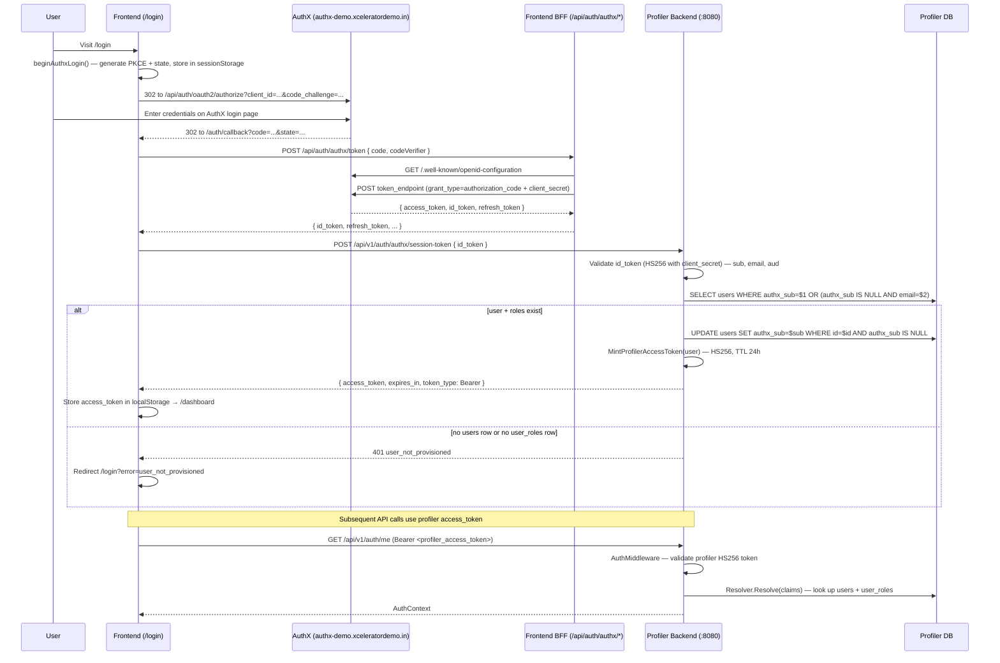

# AuthX Integration Plan — Profiler

Plan to add AuthX (Xcelerator's own better-auth OIDC IdP) as a second identity source alongside Zitadel. Zitadel remains fully functional; AuthX is enabled per-environment via a single flag.

Same architectural shape as `edx-app` + `edx-backend` on branch `feat/authx` — this document is the profiler port of that pattern.

---

## Goal

Give profiler users a "Sign in with Xcelerator" flow that:
1. Uses AuthX (OIDC / PKCE) instead of Zitadel's password Session API.
2. Reuses profiler's existing `users` / `user_roles` provisioning model — no self-signup.
3. Coexists with the Zitadel flow behind an env flag so we can flip between them without redeploying code.

---

## Design decisions (locked in)

| Question | Decision |
|----------|----------|
| Flow style | Standard OIDC redirect with PKCE (browser → AuthX login page → callback). No password proxying. |
| Migration approach | Additive. Zitadel code stays untouched. AuthX gated by `ENABLE_AUTHX` (backend) / `NEXT_PUBLIC_ENABLE_AUTHX` (frontend). |
| User linking key | `authx_sub` (UUID). New nullable column parallel to `zitadel_sub`. |
| First-login behavior | **Reject unless pre-provisioned.** Admin must have already inserted a `users` row (with the email) and at least one `user_roles` row. Login only stamps `authx_sub` onto the existing row. |
| Token model | **Two tokens.** AuthX id_token is used once to bootstrap; backend mints an internal profiler access token (HS256, TTL 24h) used for all API calls. Same pattern as edx. |
| JWT signing key | HS256 with `AUTHX_CLIENT_SECRET` as the key. Works because AuthX (better-auth) signs OIDC tokens with the OAuth client secret for confidential clients. |

---

## Feature flag

```ts
// frontend/lib/authx-config.ts (new)
export const isAuthxEnabled = process.env.NEXT_PUBLIC_ENABLE_AUTHX === "true"
```

```go
// backend/configs/config.go (modified)
EnableAuthx bool // ENABLE_AUTHX=true|false, defaults to false
```

When `false`, both apps behave exactly as they do today (Zitadel-only).

---

## Environment variables

### Backend (`profiler/backend/.env`)

Add:

| Var | Example | Purpose |
|-----|---------|---------|
| `ENABLE_AUTHX` | `true` | Master flag. If false, all authx code paths short-circuit. |
| `AUTH_IDP_URL` | `https://authx-demo.xceleratordemo.in` | AuthX base URL. Used for OIDC discovery + refresh. |
| `AUTHX_CLIENT_ID` | `client_5ggxlbeic0xzejxwm2xlsl` | OAuth client ID. Used as JWT `aud` check. |
| `AUTHX_CLIENT_SECRET` | (secret) | HS256 signing key for AuthX id_tokens AND for the profiler-minted internal access token. |

All `ZITADEL_*` vars stay as-is.

### Frontend (`profiler/frontend/.env`)

Add:

| Var | Scope | Purpose |
|-----|-------|---------|
| `NEXT_PUBLIC_ENABLE_AUTHX` | Client | UI toggle. When `true`, `/login` renders the AuthX redirect component. |
| `NEXT_PUBLIC_AUTH_IDP_URL` | Client | Public IdP URL for the browser authorize redirect. |
| `NEXT_PUBLIC_AUTHX_CLIENT_ID` | Client | Client ID for the browser authorize URL. |
| `AUTH_IDP_URL` | Server (BFF) | IdP URL for server-side token exchange. |
| `AUTHX_CLIENT_ID` | Server (BFF) | Client ID for server-side token exchange. |
| `AUTHX_CLIENT_SECRET` | Server (BFF) | Client secret for server-side token exchange. |

`AUTHX_CLIENT_SECRET` is **never** exposed to the browser — the token exchange happens in a Next.js Route Handler.

---

## Auth flow (AuthX mode)



Refresh flow: frontend calls backend `POST /auth/authx/refresh-session` with the refresh token; backend hits AuthX discovery + `token_endpoint` (grant_type=refresh_token), gets new id_token, re-runs the ensure+mint step.

---

## Backend changes (`profiler/backend`)

### Config (modified)

**`configs/config.go`** — add fields + validation:

- `EnableAuthx bool`, `AuthIdpUrl string`, `AuthxClientID string`, `AuthxClientSecret string`.
- In `Load()`: read `ENABLE_AUTHX`, `AUTH_IDP_URL`, `AUTHX_CLIENT_ID`, `AUTHX_CLIENT_SECRET`.
- If `EnableAuthx == true`, require the three AUTHX_* vars (return startup error if missing).
- Do **not** require `AUTH_IDP_URL` etc. when the flag is off — keeps single-IdP deployments simple.

### New file — `internal/auth/authx_validator.go`

Purpose: parse and validate AuthX id_tokens.

Public surface:

- `type AuthxConfig struct { Enabled bool; ClientID, ClientSecret, AuthIdpUrl string }`
- `type AuthxIDTokenClaims struct { Sub, Email, Name string }`
- `func ParseAuthxIDToken(token string, cfg AuthxConfig) (*AuthxIDTokenClaims, error)` — HS256 validation with `[]byte(cfg.ClientSecret)`, checks `aud == cfg.ClientID`, `sub` is a valid UUID, `email` non-empty. Rejects tokens with `token_type == "profiler_access"` (i.e., our own minted tokens must not sneak in through this path).

### New file — `internal/auth/authx_token.go`

Purpose: mint the internal profiler access token that the frontend uses for API calls.

Public surface:

- `func MintProfilerAccessToken(user *model.User, primary model.UserRole, cfg AuthxConfig) (token string, expiresIn int64, err error)`
- Claims payload:
  ```
  sub          = user.ID
  email        = user.Email
  name         = user.Name
  aud          = cfg.ClientID
  token_type   = "profiler_access"
  role         = primary.Role
  user_type    = "platform" | "institution" | "learner"
  institution  = primary.InstitutionID (nullable)
  exp          = now + 24h
  iat          = now
  ```
- Signed HS256 with `cfg.ClientSecret`.

### New file — `internal/auth/authx_resolver.go`

Purpose: enforce the "reject unless pre-provisioned" rule.

Public surface:

- `func EnsureAuthxUser(ctx, db, cfg, claims *AuthxIDTokenClaims) (*model.User, model.UserRole, error)`
- Steps:
  1. `SELECT * FROM users WHERE authx_sub = $sub` — if found, load roles, done.
  2. Else `SELECT * FROM users WHERE lower(email) = lower($claims.email)`:
     - If the row's `authx_sub IS NULL`: `UPDATE users SET authx_sub = $sub`. Success.
     - Else (already linked to a different sub): return `ErrAuthxSubMismatch`.
  3. Else: return `ErrUserNotProvisioned` (**never inserts a new users row**).
  4. Load `user_roles`; if empty, return `ErrUserNotProvisioned`.
  5. Return user + `pickPrimaryRole(roles)` (reuse the existing helper in `resolver.go`).

### New file — `internal/auth/authx_session_service.go`

Purpose: the two backend endpoints — mirrors `edx-backend/internal/service/authx_session_service.go`.

Public surface:

- `type AuthxSessionService struct { db, cfg, httpClient }`
- `ExchangeSessionToken(idToken string) (*SessionTokenResponse, error)` — `ParseAuthxIDToken` → `EnsureAuthxUser` → `MintProfilerAccessToken`.
- `RefreshSession(refreshToken string) (*SessionTokenResponse, error)`:
  1. Fetch `${AUTH_IDP_URL}/api/auth/.well-known/openid-configuration` (5 min in-memory cache is optional but recommended).
  2. `POST token_endpoint` with `grant_type=refresh_token`, `client_id`, `client_secret`.
  3. If response has `id_token`, `ParseAuthxIDToken` on it. Else fall back to `userinfo_endpoint` with the new `access_token`.
  4. Same ensure + mint pipeline.
- `SessionTokenResponse` = `{ access_token, expires_in, refresh_token?, token_type: "Bearer" }`.

### New file — `internal/handler/authx_handler.go`

Two Gin handlers:

- `POST /api/v1/auth/authx/session-token` — body `{ id_token }` → 200 `SessionTokenResponse` or 401 `{ error }`.
- `POST /api/v1/auth/authx/refresh-session` — body `{ refresh_token }` → 200 `SessionTokenResponse` or 401 `{ error }`.

Both short-circuit with 503 if `!cfg.EnableAuthx`.

### Middleware (modified)

**`internal/auth/validator.go`** — current file only validates Zitadel JWTs via JWKS. Change to a chained validator:

```
Validator {
  zitadelValidator  // existing RS256/JWKS
  authxCfg          // new
}
```

`Validate(ctx, token)`:
1. Cheap header inspection — if `alg == RS256`, try Zitadel path.
2. If `alg == HS256`, try AuthX path:
   - First try to parse as a **profiler-minted** access token (`token_type == "profiler_access"`, aud match, HS256 with same secret). Return a `Claims{Sub, Email, Name}` from the token itself — no round trip to AuthX needed.
   - Else parse as a raw AuthX id_token (unlikely for API calls, but safe).
3. Return the first successful parse.

Rationale: API calls carry the profiler token (which is HS256 with `AUTHX_CLIENT_SECRET`). Both are the same code path — just parse with the secret, check `token_type`.

**`internal/auth/resolver.go`** — extend `Resolve()`:

- Today: `resolveBySub(claims.Sub)` → `jitLink` by email if unlinked.
- Tomorrow: honor the token's `token_type`:
  - `token_type == "profiler_access"`: `sub` is already the profiler `users.id`. Direct lookup by ID.
  - Else (Zitadel or raw AuthX id_token): existing path.

### App wiring (modified)

**`internal/app/app.go`**:

- Build `AuthxConfig` from cfg.
- Instantiate `AuthxSessionService` and `AuthxHandler` when `cfg.EnableAuthx`.
- Register routes: `authGroup.POST("/authx/session-token", ...)`, `authGroup.POST("/authx/refresh-session", ...)`.
- Pass authx config into the chained `Validator` constructor.

Do **not** change `newRouter` signature in incompatible ways — just add the handler wiring inside the group.

### Files to leave alone

- `internal/auth/zitadel_login.go` — untouched (Zitadel Session API password login).
- `internal/handler/auth_login_handler.go` — untouched (`Login`, `TokenExchange` endpoints).
- Casbin `authz/` package — untouched (RBAC is downstream of auth resolution).

---

## Frontend changes (`profiler/frontend`)

### New file — `lib/authx-config.ts`

Two-line helper exporting `isAuthxEnabled` from `NEXT_PUBLIC_ENABLE_AUTHX`.

### New file — `lib/auth/authx.ts`

Mirrors `edx-app/src/lib/auth/authx.ts`. Exports:

- `generateCodeVerifier()` — 32 random bytes → base64url.
- `generateCodeChallenge(verifier)` — SHA-256 of verifier → base64url.
- `getAuthxRedirectUri(origin?)` — `${NEXT_PUBLIC_APP_URL}/auth/callback`.
- `beginAuthxLogin(callbackUrl?)` — stores verifier + state in `sessionStorage`, sets `window.location.href` to `${AUTH_IDP_URL}/api/auth/oauth2/authorize?...`.
- `consumeAuthxCallbackState(searchParams)` — reads code + state from URL, verifier from sessionStorage, validates state matches, returns `{ code, codeVerifier }` or `null`.
- `clearAuthxCallbackState()` — cleanup.
- `exchangeAuthxCode(code, codeVerifier)` — POST to BFF `/api/auth/authx/token`.
- `refreshAuthxToken(refreshToken)` — POST to BFF `/api/auth/authx/refresh`.

Storage keys (namespaced under `authx_`):
- `authx_code_verifier`
- `authx_oauth_state`
- `authx_flow` (set to `"authx"` during redirect, cleared on callback)

### New file — `lib/auth/session-token.ts`

Two wrappers around the profiler backend:

- `exchangeAuthxSessionToken(idToken)` → `POST ${BACKEND_URL}/api/v1/auth/authx/session-token`.
- `refreshAuthxSession(refreshToken)` → `POST ${BACKEND_URL}/api/v1/auth/authx/refresh-session`.

### New file — `app/api/auth/authx/token/route.ts`

Next.js Route Handler (server). Body: `{ code, codeVerifier }`. Steps:

1. Guard: `isAuthxEnabled` and all three server env vars present.
2. Fetch `${AUTH_IDP_URL}/api/auth/.well-known/openid-configuration`.
3. `POST discovery.token_endpoint` with `grant_type=authorization_code`, `code`, `redirect_uri`, `client_id`, `client_secret`, `code_verifier`.
4. Return `{ id_token, refresh_token, expires_in, token_type }` to the browser. Do **not** forward `access_token` — the id_token is what the browser needs.

### New file — `app/api/auth/authx/refresh/route.ts`

Similar to `token/route.ts` but with `grant_type=refresh_token`.

### New file — `app/auth/callback/page.tsx`

The AuthX callback endpoint. Server component that mounts a client component (`AuthCallback`) inside a `<Suspense>`. This is the URL registered as `AUTHX_REDIRECT_URI` in the AuthX admin — value `${NEXT_PUBLIC_APP_URL}/auth/callback`.

### New file — `components/authx-callback.tsx`

Client component. Steps in `useEffect`:

1. `consumeAuthxCallbackState(searchParams)` → `{ code, codeVerifier }` or bail to `/login`.
2. `exchangeAuthxCode(code, codeVerifier)` → `{ id_token, refresh_token }`.
3. `exchangeAuthxSessionToken(id_token)` → `{ access_token, expires_in }`.
4. `setAccessToken(access_token)` (reuses `lib/config.ts`), store `refresh_token` under `authx_refresh_token`.
5. `router.replace("/dashboard")`.

Errors at any step: `router.replace("/login?error=<reason>")`.

Add an in-flight lock like edx-app does (module-level `Promise` var) — React StrictMode fires effects twice in dev and would otherwise try to exchange the same code twice.

### New file — `components/authx-sign-in.tsx`

Rendered by `/login` when `isAuthxEnabled`. On mount, calls `beginAuthxLogin()`. Uses a 15s sessionStorage lock (`authx_login_lock`) to prevent double-redirects during React StrictMode double-invocation. Shows a retry button on error.

### Modified — `app/login/page.tsx`

At the top of the export:

```
if (isAuthxEnabled) return <AuthxSignIn />
```

Everything else in the file stays exactly as-is (Zitadel form path continues to work when the flag is off).

### Modified — `lib/config.ts`

Add:

```
export const AUTHX_REFRESH_TOKEN_KEY = "authx_refresh_token"
```

Everything else stays the same. Keep `redirectPath: "/api/auth/callback/zitadel"` — that's the Zitadel path. AuthX uses `/auth/callback` directly.

### Files to leave alone

- `app/api/auth/callback/zitadel/page.tsx` — untouched (Zitadel callback).
- `components/auth-callback.tsx` — untouched (Zitadel callback logic).
- All existing `contexts/`, `hooks/`, `proxy.ts` — untouched.

---

## DB migration

Add `authx_sub` column to `users`. Nullable, unique. New migration file under `backend/migrations/`:

```sql
-- 0NNN_add_authx_sub_to_users.up.sql
ALTER TABLE users ADD COLUMN authx_sub UUID;
CREATE UNIQUE INDEX IF NOT EXISTS users_authx_sub_key ON users(authx_sub) WHERE authx_sub IS NOT NULL;

-- 0NNN_add_authx_sub_to_users.down.sql
DROP INDEX IF EXISTS users_authx_sub_key;
ALTER TABLE users DROP COLUMN authx_sub;
```

Partial unique index (`WHERE authx_sub IS NOT NULL`) lets us preserve the existing Zitadel-only rows without conflict.

### Model change

`internal/model/models.go` — add:

```
type User struct {
    // ...existing fields...
    AuthxSub *string `db:"authx_sub"`
}
```

### Repo methods

`internal/repository/user_repository.go` — add:

- `GetWithRolesByAuthxSub(ctx, sub string) (*User, []UserRole, error)`
- `LinkAuthxSub(ctx, userID uuid.UUID, sub string) error`

Symmetric to the existing Zitadel methods.

---

## First-login behavior (pre-provisioning)

Because we picked "reject unless pre-provisioned", the operator experience is:

1. Admin creates the user in AuthX (or user is already there).
2. Admin inserts a row into profiler `users` with the exact email (case-insensitive match).
3. Admin inserts at least one `user_roles` row for that user.
4. User visits `/login`, is redirected to AuthX, signs in.
5. Backend `EnsureAuthxUser`:
   - Finds users row by email.
   - Stamps `authx_sub` on it (one-time).
   - Returns success.
6. Subsequent logins match on `authx_sub` directly — email lookup is only used once.

If step 2 or 3 is missing, the user sees `/login?error=user_not_provisioned` (same UX as today's Zitadel flow).

---

## Testing checklist

Before merge:

- [ ] `ENABLE_AUTHX=false` — Zitadel form still works end-to-end.
- [ ] `ENABLE_AUTHX=true`, no pre-provisioned row — `/login` → AuthX → callback → `/login?error=user_not_provisioned`.
- [ ] `ENABLE_AUTHX=true`, pre-provisioned row — `/login` → AuthX → `/dashboard`. Verify `authx_sub` populated in DB.
- [ ] Second login for same user — no new DB write, straight to `/dashboard`.
- [ ] User exists with `authx_sub` already set, someone else signs in with the same email in AuthX (different sub) — 401 `authx_sub_mismatch`.
- [ ] Profiler access token expires (or delete from localStorage) — refresh flow mints a new one without re-login.
- [ ] Casbin/RBAC — user with `institution_admin` role sees only their institution's data.
- [ ] React StrictMode double-render doesn't double-consume the OAuth code (in-flight lock works).
- [ ] Refresh token stored under `authx_refresh_token`, not the Zitadel token key.

---

## Rollback

Any of these individually reverts to Zitadel-only:

- Set `ENABLE_AUTHX=false` on backend, `NEXT_PUBLIC_ENABLE_AUTHX=false` on frontend, restart both.
- Or drop the migration: `authx_sub` column is nullable and additive — dropping it doesn't break Zitadel rows.

No AuthX code paths execute when the flag is off.

---

## Out of scope

- Multi-tenant AuthX (multiple `AUTHX_CLIENT_ID`s per deployment).
- AuthX admin UI inside profiler.
- Migrating existing Zitadel users to AuthX (would need a separate one-time script that maps `zitadel_sub → authx_sub` by email).
- SSO between profiler and other Xcelerator apps (already handled by AuthX being a shared IdP — nothing profiler-specific needed).
