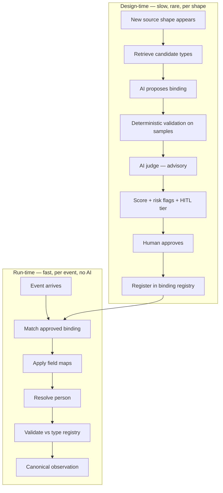
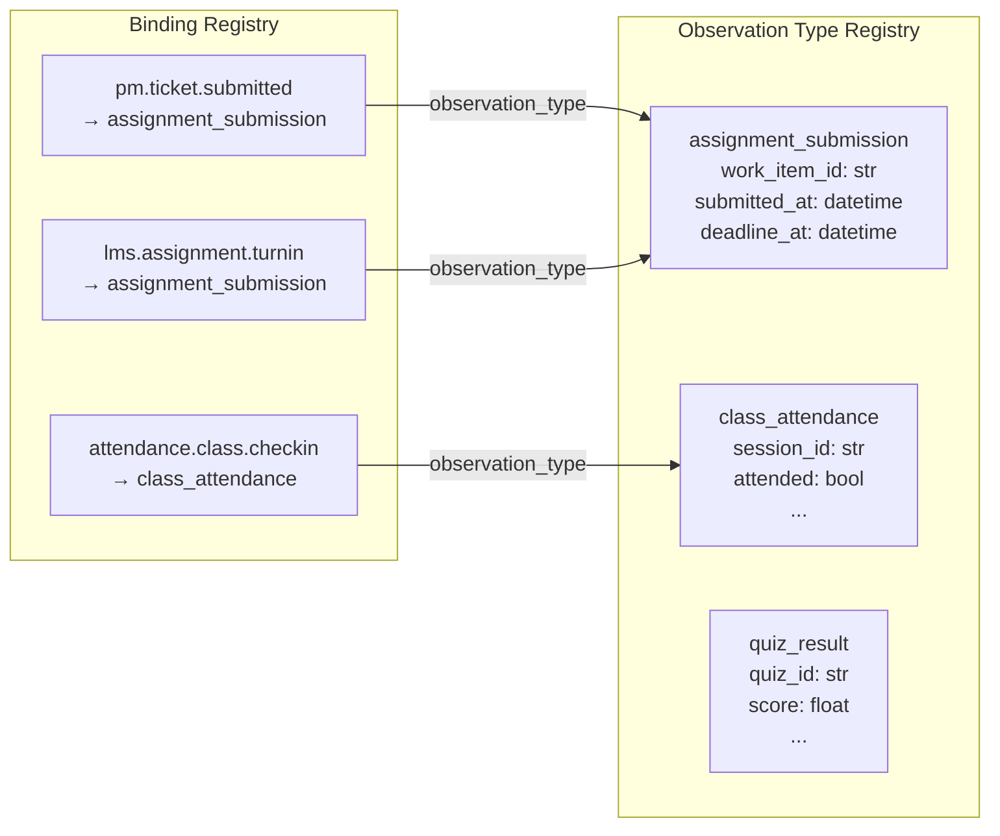
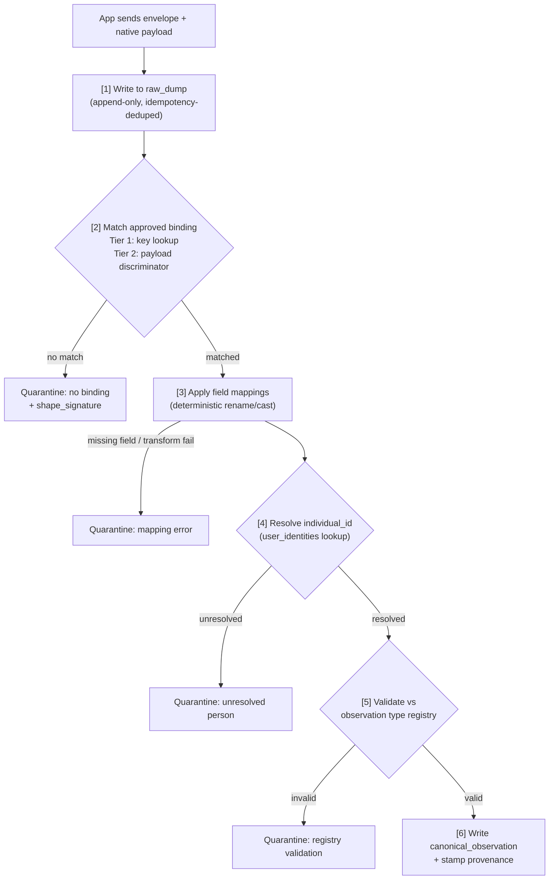
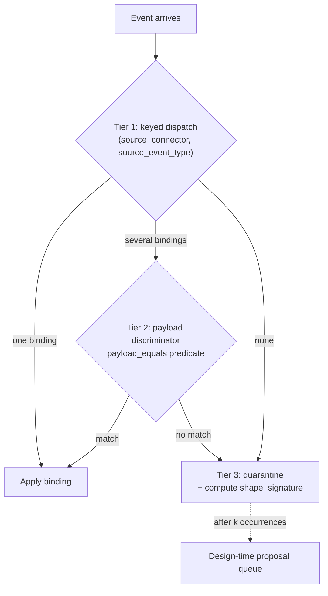
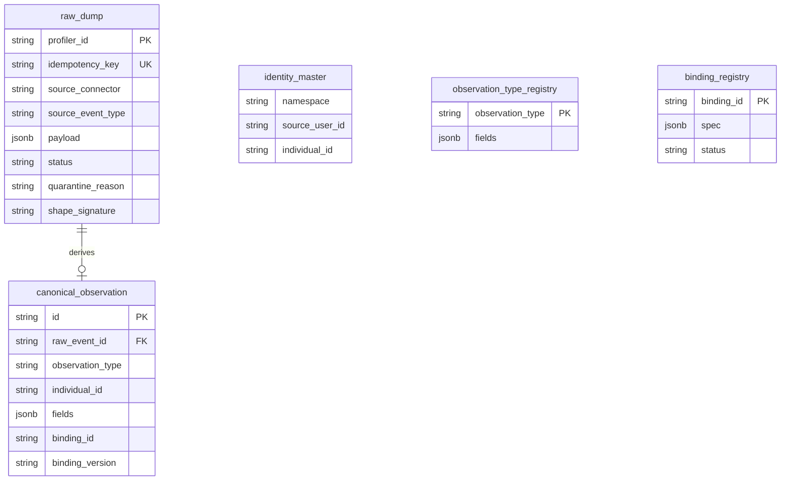

# Observation Layer — Design Reference

> **Subsystem appendix.** The unified profiling service architecture is documented in [profiling_service_architecture.md](profiling_service_architecture.md).

**Version:** POC v0  
**Scope:** Raw envelope ingestion through canonical observation production. Signals, derivation, and metrics are downstream.

This document describes the observation layer implemented in the `observation_layer/` package. It complements the original reference docs in `docs/reference/` and the runnable demo in `notebooks/observation_layer_demo.ipynb`.

---

## 1. Purpose and scope

The observation layer receives data from many applications (LMS, project management, attendance, mentorship, job board, and eventually third parties) and turns it into **clean, typed, canonical observations** that the rest of the profiling system can build signals from.

**What this layer does:**

- Accept a standard **envelope** from any connector
- Store the raw event verbatim (append-only, never dropped)
- Match an approved **binding** for the source + shape
- Deterministically map native payload fields → canonical fields
- Resolve the person to a global `individual_id`
- Validate against the **observation type registry**
- Emit a **canonical observation** with full provenance, or **quarantine** with a reason

**What this layer does not do:**

- Derive signals from observations (derivation layer)
- Aggregate signals into metrics (aggregation layer)
- Apply reward-system lenses or trait weighting

The layer's job ends at producing a canonical observation. Everything above that is documented separately.

---

## 2. The problem

Observations arrive from many sources, each with its own schema and naming conventions. The same logical fact looks structurally different depending on where it comes from.

| Concept | PM app sends | LMS sends |
|---------|-------------|-----------|
| The work item | `task_id` | `assignment_id` |
| Time submitted | `submitted_on` | `submitted_time` |
| The due date | `deadline_on` | `deadline_at` |

Both carry the data we need; neither uses the names we want. We cannot force every app to emit data in one internal format — especially third-party applications.

Yet everything downstream needs uniformity. A derivation rule like "submitted early" must consume the same fields with the same names and types, regardless of source. Otherwise we need a separate rule per app, which defeats the design.

**The observation layer absorbs diversity and emits uniformity.** This is the classic Canonical Data Model + Anti-Corruption Layer pattern.

---

## 3. Core design decision: enforce the envelope, translate the payload

Every incoming observation splits into two parts treated completely differently:

| Part | Who defines it | Constraint |
|------|---------------|------------|
| **Envelope** | Profiling system (standard contract) | Strict — every app must wrap data in it |
| **Payload** | Source app (native fields) | Free — any names, any shape |

Apps send native data in a thin standard wrapper. Translation into canonical form is done by a versioned, declarative artifact called a **binding** — authored once per `(source, shape)`, not per event.

This mirrors [CloudEvents](https://cloudevents.io/): a small required envelope (id, source, type, time) and free-form domain data in a separate payload field.

---

## 4. The two clocks

The hardest design question — "how do we decide what type an observation is?" — only feels intractable if it happens on every event. It should not.



| Clock | When | What happens | AI? |
|-------|------|--------------|-----|
| **Design-time** | Once per `(source, shape)` | Propose, validate, review, approve a binding | Yes (advisory) |
| **Run-time** | Every event | Lookup binding, apply deterministically | Never |

Human effort scales with the **variety of shapes** (bounded — dozens across all apps), not the **volume of events** (unbounded).

---

## 5. The two registries

The observation layer is driven by two declarative, versioned registries. Both are owned by the profiling team.



### 5.1 Observation Type Registry — the target language

Defines, for each canonical observation type, exactly which fields it has and their types. This is the **contract** that bindings are validated against.

Example entry:

```
assignment_submission:
    work_item_id : str
    submitted_at : datetime
    deadline_at  : datetime
```

- Authored **top-down** by the profiling team (before or during onboarding)
- Grows **additively** with compatibility checks (see Section 10)
- Stored in DB table: `observation_type_registry`
- POC types: `assignment_submission`, `class_attendance`, `quiz_result`, `mentor_attested_punctuality`, `skill_declared`, `task_self_claimed`

### 5.2 Binding Registry — per-source translators

One binding per `(source_connector, source_event_type [, payload discriminator])`. Describes how to turn a source's native payload into one canonical observation type.

A binding has four jobs:

| Part | What it contains |
|------|-----------------|
| **Match** | When it fires: `source_event_type` + optional `payload_equals` discriminator |
| **Target** | Which `observation_type` it emits; optional `domain`; `ingestion_altitude` |
| **Field mappings** | For each canonical field: source path + transform (rename, cast, parse_datetime, etc.) |
| **Entity resolution** | Where the person id sits in the payload + which namespace to look up |
| **Governance** | `status` (candidate / approved / deprecated), version, provenance |

- Authored at **design-time** (AI-proposed + human-approved during onboarding)
- Stored in DB table: `binding_registry`
- Only `APPROVED` bindings are used at run-time

**Key relationship:** A binding does not define the canonical type — it **references** one from the observation type registry and maps into it. The type registry is the contract; the binding must satisfy it.

---

## 6. Run-time pipeline



Implemented in `observation_layer/engine.py` as `ingest_event()`:

1. `write_raw()` — persist envelope verbatim; skip if `idempotency_key` already exists
2. `route_binding()` / `canonicalize()` — find approved binding
3. `apply_binding()` — field maps + identity + validation
4. `persist_canonical()` or `persist_quarantine()` — write result

**Principle: store raw, always.** Raw events are the source of truth. Canonical observations are a re-derivable view from `(raw event + binding version)`.

---

## 7. Routing tiers

At run-time the system never runs a model. It resolves an incoming event to a binding through three tiers:



| Tier | Mechanism | Example |
|------|-----------|---------|
| **Tier 1** | O(1) hash lookup on `(source_connector, source_event_type)` | `pm` + `ticket.submitted` → `pm.assignment_submission` |
| **Tier 2** | Declarative `payload_equals` on binding match condition | `pm` + `task.updated` + `{self_claimed: true}` → `pm.task_self_claimed` |
| **Tier 3** | No match → quarantine, compute shape signature for dedup | `job_board` + `profile.skill_added` (no binding yet) |

---

## 8. Identity resolution

Every observation must be tied to a person. This runs at step 4 in the pipeline (after field mapping, before validation). The binding's `entity_resolution` block declares which payload field holds the user id.

Same person, different ids per app:

| App | Their user id | Email |
|-----|---------------|-------|
| Projex | `abc` | neeraj@gmail.com |
| VTU | `123` | neeraj@gmail.com |
| Mentorship | `xyz` | neeraj@gmail.com |

Profiler needs one `users.id` for Neeraj. Apps only send their own id in the payload — never Profiler's id. The canonical observation stores it as `individual_id`.

### 8.1 Data model

Two Profiler tables:

**`users`** — the person  
- `email`, `name`, `institution_id`  
- Email answers: *"who is this human?"*

**`user_identities`** — each app's nickname for that person  
- One row per app id (`projex/abc`, `vtu/123`, …) → `users.id`  
- `external_id` is a string  
- Unique: `(data_source_id, external_id)`

```
users
  user-99  |  neeraj@gmail.com  |  Neeraj

user_identities
  projex      + "abc"  →  user-99
  vtu         + "123"  →  user-99
  mentorship  + "xyz"  →  user-99
```

**Why a separate table, not JSON on `users`?** Events ask *"VTU sent `123` — who is that?"* An indexed lookup table answers that fast. JSON on the user row is slow and can't enforce uniqueness.

The POC observation-layer package uses the same pattern as `identity_master` (`namespace` + `source_user_id` → `individual_id`). In Profiler DB this is `user_identities` → `users.id`.

### 8.2 Automatic flow (default)

Every event is handled automatically. No admin step in the normal path.

```
Event arrives (user_id + email)
        │
   Already in user_identities?
        │
   yes ──→ attach users.id → done
        │
   no ──→ match by email in same institution
        │
   one match  ──→ add user_identities row → done
   no match   ──→ create users + user_identities → done
   2+ matches ──→ quarantine (see 8.4)
```

**Example — Neeraj never existed in Profiler:**

1. VTU sends `user_id: "123"`, `email: neeraj@gmail.com` → auto-create `users` + `user_identities`
2. Projex later sends `user_id: "abc"`, same email → auto-add `projex:abc` row only
3. All future events → instant lookup, no email needed

The person does not need to exist before data arrives. Resolution is deterministic only (no fuzzy matching). Scope by `institution_id`.

### 8.3 Optional: bootstrap at setup

Bulk-import user lists from each app at onboarding (`user_id` + `email`) to pre-fill `user_identities`. Still automatic — runs once upfront so the first event is a fast lookup. Not required.

### 8.4 When automatic can't decide

Rare cases. Event is **quarantined** (saved, not profiled) until fixed:

| Situation | Why |
|-----------|-----|
| `user_id` but **no email** | Can't tell who `123` is |
| **Two users** share the same email | Can't guess which one |
| Admin **manually links** a quarantined event | Back-fill runs after fix |

When linked later → back-fill quarantined events. Raw events are never dropped.

### 8.5 Scenarios

| Situation | What Profiler does |
|-----------|-------------------|
| App already sent this user id before | Instant lookup |
| New app, person already exists from another app | Add one mapping row |
| Completely new person with email | Create user + mapping |
| Event has id but no email | Quarantine |
| Two people, same email | Quarantine |
| Same email at two colleges | Two separate users |
| Two accounts in same app, same email | Both map to one user |

**Principles:** `users.email` = who they are. `user_identities` = what each app calls them. Wrong merge is worse than quarantine.

---

## 9. Design-time: binding proposal pipeline

When a new `(source, shape)` appears (connector onboarding, quarantine threshold, or drift), the proposal pipeline runs **once per shape**:

```mermaid
flowchart LR
  SAMPLES[Shape + sample events] --> R[1. Retrieve candidate types]
  R --> P[2. Propose binding — AI x N runs]
  P --> V[3. Validate on samples — deterministic]
  V --> J[4. Judge — AI advisory]
  J --> SC[5. Score + risk flags + tier]
  SC --> H[6. Human review]
  H -->|approve| REG[Register binding]
  REG --> BF[Back-fill quarantined events]
```



**Trust model:** The deterministic validator is authoritative. AI stages are advisory. Payload sample values are untrusted external input, so AI output is always validated by code and approved by a human.

| Stage | Module | AI? | Role |
|-------|--------|-----|------|
| Retrieve | `proposal.py` | No (embeddings in prod) | Narrow candidate types from registry |
| Propose | `proposal.py` | Yes (OpenRouter) | Generate binding: type, field maps, transforms |
| Validate | `proposal.py` + `engine.py` | No | Execute binding on samples; check registry compliance |
| Judge | `proposal.py` | Yes (advisory) | Semantic plausibility score |
| Score | `proposal.py` | No | Blend signals → confidence + risk flags + HITL tier |
| Approve | `proposal.py` | Human | Promote candidate → approved; register; back-fill |

Risk flags fire **regardless of confidence**: `new_observation_type`, `failed_validation`, `writes_pii`, `few_samples`, etc. Nothing auto-approves.

---

## 10. Storage model

Five PostgreSQL tables (Neon in the POC):



| Table | Role | Mutable? |
|-------|------|----------|
| `raw_dump` | Append-only store of every event as received | Payload never altered; status updated |
| `canonical_observation` | Derived, typed output | Re-derivable from raw + binding |
| `identity_master` | Deterministic person resolution (`user_identities` in Profiler DB) | Grows as people are linked |
| `observation_type_registry` | Canonical type contracts | Additive evolution only |
| `binding_registry` | Versioned per-source translators | New versions; old versions kept |

---

## 11. Registry evolution

Canonical fields feed psychometric metrics over time. A silent rename or retype corrupts longitudinal comparability. The rule is **additive evolution**, enforced by a compatibility check (Avro-style):

| Change | Backward | Forward | Full |
|--------|----------|---------|------|
| Add optional field | safe | safe | safe |
| Add required field | break | safe | break |
| Remove a field | safe | break | break |
| Retype a field | break | break | break |
| Rename a field | break (shows as remove + add) | break | break |

Implemented in `observation_layer/evolution.py`. Run in CI before any type change ships.

---

## 12. Three "type" fields (common confusion)

| Field | Who sets it | Example | Meaning |
|-------|------------|---------|---------|
| `source_event_type` | App | `ticket.submitted` | The app's own raw event name |
| `ingestion_altitude` | App | `observation` or `signal` | Raw data vs already-derived |
| `observation_type` | Binding (not the app) | `assignment_submission` | Our canonical type |

Apps never send `observation_type`. Deciding that PM's `ticket.submitted` and LMS's `assignment.turnin` are both `assignment_submission` is the binding's job.

---

## 13. POC vs production

| Aspect | POC (this repo) | Production |
|--------|----------------|------------|
| Bindings | Mostly hand-seeded in `seed.py` as `APPROVED` | AI-proposed + human-approved during onboarding |
| Job-board binding | Intentionally omitted; demonstrated via proposal pipeline in notebook | Real onboarding flow |
| AI proposer | OpenRouter via OpenAI SDK (with mock fallback) | Production model + embedding retrieval |
| Identity | `user_identities` lookup → `users.id` (Section 8) | Full entity resolution service |
| Drift detection | Not implemented in POC | Flags schema changes, triggers re-proposal |
| API | FastAPI sketch (`observation_layer/api.py`) | Production ingestion service |

---

## 14. Module map

```
observation_layer/
  config.py       — .env loading (DB, OpenRouter)
  db.py           — SQLAlchemy engine, ORM tables, create_tables()
  models.py       — Pydantic: RawEvent, SourceBinding, CanonicalObservation, registries
  store.py        — write_raw, persist_canonical, persist_quarantine
  identity.py     — resolve_identity, link_identity, build_identity_map
  registries.py   — load/save type and binding registries from DB
  engine.py       — route_binding, apply_binding, canonicalize, ingest_event, backfill_shape
  shapes.py       — shape_signature for quarantine dedup
  proposal.py     — design-time pipeline: propose, validate, judge, score, approve
  evolution.py    — registry compatibility checks
  api.py          — FastAPI HTTP ingestion sketch
  seed.py         — demo data: types, bindings, identity rows
```

---

## 15. Related documents

| Document | Description |
|----------|-------------|
| [observation_layer_demo_walkthrough.md](observation_layer_demo_walkthrough.md) | Step-by-step notebook companion with input/output examples |
| [reference/observation_layer_guide.docx](reference/) | Original design rationale (working doc) |
| [reference/binding_lifecycle_operations.docx](reference/) | Binding proposal, HITL, and evolution methodology |
| [reference/observation_envelope_contract.docx](reference/) | App integration contract (what connectors send) |
| [reference/source_binding.py](reference/source_binding.py) | Frozen reference implementation |
| [notebooks/observation_layer_demo.ipynb](../notebooks/observation_layer_demo.ipynb) | Runnable end-to-end demo |
